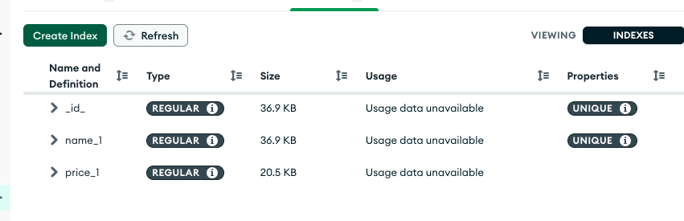

# **Node JS notes**

## Section 1

What is Node JS ?

Node. js is a single-threaded, open-source, cross-platform runtime environment for building fast and scalable server-side and networking applications. It runs on the V8 JavaScript runtime engine, and it uses event-driven, non-blocking I/O architecture, which makes it efficient and suitable for real-time applications

## Section 2 Intro to Node JS

- How to import core node modules or your own modules, or 3rd party modules
- Reading and writing files
- Creating a Web Server
- Routing, templating
- Package versioning
- Setting up prettier

## Section 3 - Back end development

- How the web works
- HTTP in action
- Request headers
- Static vs Dynamic API

## Section 4 - How Node JS Works

- Javascript on server side to build highly scalable web applications
- Single threaded, based on event driven, non-blocking, I/O model.
- Perfect for building fast and scalable data-ontensive app.

### Use cases

API with database
Data streaming, like youtube
real-time chat app
Server-side web app

Don't use for Apps with heavy server side processing CPu intensive

## Section 5 - asynchronous javascript, Promises and async/await

- Building promises
- Consuming promises
- Returning values from async functions
- Waiting for multiple promises simultaneaously

## Section 6 - Building Natours App - Express JS

- Set up Express and Basic Routing

Express contains a very robust set of features: complex routing, easier handling of requests and responses, middleware, server side rendering etc

Express allows for rapid development of Node js apps.
Express makes it easier to organise our app into the MVC architecture.

`npm i express`

Then in the app.js:

```
  const express = require('express')

  app.get('/', (req, res) => {
    res.status(200).send('Hello from the server side!)
  })

  const app = express()

  const port = 3000
  app.listen(port, () => {
    console.log(`App running on port ${port}...`)
  })

```

At this point you could test this by running
`nodemon app.js`

And you should see the message in terminal

And you can start testing this in Postman
Just add GET request to 127.0.0.1:3000 and hit send

Now instead of sending a string to client, you could send json.

So change it to:

```
  const express = require('express')

  app.get('/', (req, res) => {
    res
    .status(200).
    .json({ message: 'Hello from server side!', app: 'Natours'})
  })

  const app = express()

  const port = 3000
  app.listen(port, () => {
    console.log(`App running on port ${port}...`)
  })

```

At this stage we are getting the data from our data file locally, so we need to read it with fs.readFileSync, which is asynchronous

```
  const tours = JSON.parse(fs.readFileSync(`${__dirname}/tours-simple.json`, 'utf-8'))
```

So now you get back json response in Postman!

Next, we change the GET request to an endpoint

```
  app.get('/api/v1/tours', (req, res) => {
    res.status(200).json({
      status: 'success',
      data: {
        tours
      }
    })
  })
```

<span style="background-color:purple">
So to summarise, when we call this endpoint '/api/v1/tours', the app.get is called, and that in turn returns the data which is the tours we fetched with readFileSync
</span>

</br>

### POST request - need Middleware

Out of the box Express does not allow you to just do post request, we need to use a middleware for this, so the way to do it is:

```
  app.use(express.json)
```

This will use the middleware to add a body to the request

If you console log the req.body in the app.post, you can see what the data looks like

```
  app.post('/api/v1/tours', (req, res) => {
    console.log(req.body)
    res.send('Done)
  })
```

### Refactoring

we can move the callback functions into their own function

For example:

```
const getAllTours = (req, res) => {
  res.status(200).json({
    status: 'success',
    results: tours.length,
    data: {
      tours
    }
  })
}
```

So now we can simply call that function after the route:

```
app.get('/api/v1/tours', getAllTours)
```

Now, we can take this refactoring a little further, and chain requests which are on the same route:

```
  app
    .route('/api/v1/tours')
    .get(getAllTours)
    .post(createTour)
```

Similarly we can chain all requests for the route which needs an ID on the end:

```
  app
    .route('/api/v1/tours:id')
    .get(getTour)
    .patch(updateTour)
    .delete(deleteTour)
```

Then we end up moving all the route handlers into their own file and exporting them

So for tours we did this:


Side note, what tech is used in above code?

<span style="background-color:#1a75ff">
  Node.js: The JavaScript runtime environment that allows the execution of server-side code.
  Express: The web application framework for Node.js that is used to create web applications and APIs. This is inferred from the use of req, res, and next objects, which are typical in Express middleware functions and route handlers.
  MongoDB: The NoSQL database where the user data is stored. This is indicated by the use of User.findOne({ email: req.body.email }) to query the database.
  Mongoose: The Object Data Modeling (ODM) library for MongoDB and Node.js, used for managing relationships between data and performing schema validation. This is suggested by the use of Mongoose methods like findOne and save on the User model.
</span>

Then we import all the route handlers in tourRoutes, and use object destructuring and pass those into the appropriate routes


### Middleware

## Section 7 - Intro to Mongo DB

## Section 8 - Using Mongo DB with Mongoose

Mongoose is an Object Data Modeling (ODM) library for MongoDB and Node.js. It provides a higher-level abstraction for working with MongoDB, allowing developers to define schemas for their data models, validate data, and interact with the database using JavaScript objects instead of directly writing MongoDB queries. Here are some key features and uses of Mongoose:

Key Features
Schema Definitions: Mongoose allows you to define the structure of your documents and the data types of their fields. This ensures data consistency and integrity.

Data Validation: You can define validation rules for your schema fields, ensuring that data meets specific criteria before being saved to the database.

Middleware: Mongoose supports middleware (also known as pre and post hooks) that allows you to perform operations before or after certain actions, such as saving or deleting a document.

Query Building: Mongoose provides a rich API for building and executing queries, making it easier to retrieve and manipulate data.

Population: This feature allows you to reference documents in other collections, enabling complex data relationships similar to joins in relational databases.

Virtuals: Virtual properties allow you to define fields that are computed from other fields but are not stored in the database.

Plugins: Mongoose has a plugin system that allows you to add reusable functionality to your schemas and models.

Common Uses
Data Modeling: Mongoose is used to define the structure of the data and the relationships between different pieces of data in an application.

Data Validation and Sanitization: By enforcing schema rules and custom validation logic, Mongoose ensures that only valid data is stored in the database.

CRUD Operations: Mongoose simplifies the process of creating, reading, updating, and deleting documents in MongoDB, providing an easy-to-use API.

Middleware for Pre and Post Operations: Mongoose middleware functions allow you to execute code before or after certain operations, such as running custom logic before saving a document.

Complex Queries and Aggregations: Mongoose's query API supports complex queries and aggregations, making it easier to retrieve and process data from MongoDB.

Example Use Case
Suppose you are building a blogging platform where users can create and manage posts. You could use Mongoose to define the schema for the posts and users, validate data, and handle database operations.

```
const mongoose = require('mongoose');

// Define the user schema
const userSchema = new mongoose.Schema({
  username: {
    type: String,
    required: [true, 'Username is required'],
    unique: true,
    trim: true,
  },
  email: {
    type: String,
    required: [true, 'Email is required'],
    unique: true,
    match: [/.+\@.+\..+/, 'Please fill a valid email address'],
  },
  password: {
    type: String,
    required: [true, 'Password is required'],
    minlength: 6,
  }
});

// Define the post schema
const postSchema = new mongoose.Schema({
  title: {
    type: String,
    required: [true, 'Title is required'],
    trim: true,
  },
  body: {
    type: String,
    required: [true, 'Body is required'],
  },
  author: {
    type: mongoose.Schema.Types.ObjectId,
    ref: 'User',
    required: [true, 'Author is required'],
  },
  createdAt: {
    type: Date,
    default: Date.now,
  },
});

// Create the models
const User = mongoose.model('User', userSchema);
const Post = mongoose.model('Post', postSchema);

// Example of creating a new user
const newUser = new User({
  username: 'johndoe',
  email: 'john.doe@example.com',
  password: 'securepassword',
});

// Save the new user to the database
newUser.save()
  .then(user => {
    console.log('User saved:', user);

    // Example of creating a new post
    const newPost = new Post({
      title: 'My First Post',
      body: 'This is the content of my first post.',
      author: user._id,
    });

    // Save the new post to the database
    return newPost.save();
  })
  .then(post => {
    console.log('Post saved:', post);
  })
  .catch(err => {
    console.error('Error:', err);
  });

```

In this example, Mongoose is used to define schemas for users and posts, validate the data, create new documents, and handle the relationships between the documents (e.g., the author field in the Post schema references a User document).

### MVC Pattern

A pattern we got into in this course was to create a tourModel, or update the tourModel with more code, then update the tourController, for example getAllTours looks like this:

```
exports.getAllTours = catchAsync(async (req, res, next) => {
  const features = new APIFeatures(Tour.find(), req.query)
    .filter()
    .sort()
    .limitFields()
    .paginate()

  const tours = await features.query
  res.status(200).json({
    status: 'success',
    results: tours.length,
    data: {
      tours
    }
  })
})
```

Then update the route to handle the incoming requests, for example for getAllTours, this is handling get requests to the root, ie "/" and calling the getAllTours from the tour controller.

The getAllTours function is designed to retrieve all tours from the mongo db database with various query features applied, such as filtering, sorting, field limiting, and pagination.

```
router
  .route('/')
  .get(authController.protect, getAllTours)
  .post(createTour)
```

## Model

File: tourModel.js

The model is responsible for defining the structure of the data and handling data-related logic. In this case, the Tour model defines the schema for tours using Mongoose.

Purpose: Defines the structure of the Tour documents in the MongoDB database, including validation, virtual properties, and middleware for handling specific operations on documents.

## View

File: tourRoutes.js

In the context of a typical web application, views are usually templates or components that render the UI. However, in a RESTful API, views are represented by the routes that determine which controller function to call based on the HTTP request.
Purpose: Maps HTTP routes to controller functions. It ensures that the correct function is called for each endpoint, handling route-specific middleware such as authentication and authorization.

## Controller

File: tourController.js

Controllers handle the logic for responding to HTTP requests. They interact with the model to retrieve or modify data and send the appropriate response to the client.
Purpose: Implements the business logic for handling requests related to tours. It uses the model to query the database and sends responses to the client, handling any necessary processing or data manipulation.

## MVC Summary

Model (tourModel.js): Defines the data structure and handles data validation and manipulation.
View (tourRoutes.js): Maps URL paths to controller actions, acting as an intermediary between the client and the controller.
Controller (tourController.js): Contains the logic for handling requests, manipulating data using the model, and sending appropriate responses.
In this MVC pattern:

Model handles data-related logic.
View handles routing and request mapping.
Controller handles the application logic and user interactions.

## Breakdown of how the review route handlers work

To understand how the reviews route works in this Express application, let's break down the setup and functionality based on the code snippets provided:

Main Tour Router Setup:

The main router for tours is defined in a file where you are setting up various routes related to tours.
When the URL pattern /:tourId/reviews is encountered, the reviewRouter is used. This is achieved by the line:
javascript
Copy code
router.use('/:tourId/reviews', reviewRouter);
Review Router Setup:

The reviewRouter is defined separately and handles the review-specific routes.
The express.Router({ mergeParams: true }) ensures that the tourId parameter from the parent route is accessible within the review router.
The routes defined in the review router are:


POST Request to Add a Review:

To add a review to a specific tour, a POST request is made to the endpoint {{URL}}/api/v1/tours/5c88fa8cf4afda39709c2955/reviews.
This request will be handled by the createReview controller function in the reviewController.
Middleware functions authController.protect and authController.restrictTo('user') ensure that only authenticated users with the role user can add a review.
Example Flow of a POST Request to Add a Review
Incoming Request:

A user sends a POST request to {{URL}}/api/v1/tours/5c88fa8cf4afda39709c2955/reviews with the review data in the request body.
Main Router:

The main router receives the request and matches the route pattern /:tourId/reviews.
The tourId in this case is 5c88fa8cf4afda39709c2955.
Review Router:

The request is forwarded to the reviewRouter because of the router.use('/:tourId/reviews', reviewRouter) line.
The mergeParams: true option ensures that tourId is available in the reviewRouter.
Review Router Handling:

The POST request matches the route defined in the review router:


Middleware functions authController.protect and authController.restrictTo('user') run first to ensure the user is authenticated and has the user role.
Create Review Controller:

Finally, the createReview function in the reviewController handles the request, adding the review to the database associated with the tour ID 5c88fa8cf4afda39709c2955.

## Summary

The main router delegates review-related routes to the reviewRouter.
The reviewRouter uses mergeParams: true to inherit parameters from the parent route.
Middleware ensures that only authenticated users with the user role can create reviews.
The createReview controller function handles the logic for adding a review to the specified tour.

## Improving read performace with indexes

https://www.mongodb.com/docs/manual/indexes/?utm_source=compass&utm_medium=product#single-field

If you add explain() at the end of a query


you can see statistics on the query results:


Now this shows that although it returned 3 documents because in the query string you may have added some filtering, it did actually scan the whole tours data to filter out these 3 which is not greatly efficient, especially if handling large data sets.

If you look in Compass, there is an indexes tab which shows the size of the indexes.
So what MongoDB does is it stores an indexes list of all the data which sits outside of the main data and mongodb will search thorugh this list of indexes instead of looking at the whole data:


In MongoDB, creating an index on a collection allows for more efficient querying of data. When you use the command tourSchema.index({ price: 1 }), you are defining an index on the price field in the tourSchema schema. Here's what this does and how it works:

Creating the Index:

tourSchema refers to the schema definition for a MongoDB collection, typically defined using a library like Mongoose in a Node.js environment.
.index({ price: 1 }) creates an ascending index on the price field. The 1 specifies ascending order, while -1 would specify descending order.
Purpose of the Index:

An index on the price field allows the MongoDB database to quickly locate documents where the price matches a query condition, without having to scan the entire collection.
This is particularly useful for queries that involve sorting, filtering, or range queries on the price field.
Performance Benefits:

Faster Queries: By indexing the price field, queries that filter or sort by price will be much faster.
Efficient Sorting: If you frequently sort by price, the index will make these operations more efficient.
Range Queries: Queries that look for documents within a certain range of prices will benefit from the index, as the database can quickly find the start and end points of the range.
Considerations:

Storage Cost: Indexes consume additional disk space. While they speed up read operations, they require additional storage.
Write Performance: Indexes can impact write performance because the index must be updated each time a document is inserted, updated, or deleted.
Choice of Fields: It's important to index fields that are frequently used in queries. Over-indexing can lead to unnecessary overhead.

Now if we go back to Compass, we can see a new index with a lower size of 20.5kb



This does come with a cost, as it will need more storage, so you will need to look at using this if you know which fields are queried often so you can apply index on those fields.
